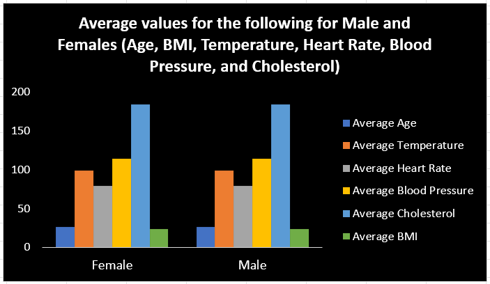

# Data-Analysis-Cohort-3-Excel-Assignments_Week-2

# Excel Medical Data Analysis

## Introduction
This is an assignment as part of a **Data Analysis Bootcamp facilitated by Promise Chinonso and Victor Somadina**. The data worked on is an imaginary set of Medical Data for 200,000 people. The demographics of the people in the data set are males and females between the ages of 18 and 34. The data collected included their height, weight, BMI, Blood Group, and heart rate.

## Tasks
### For Task 1
We were required to use the Medical Students Dataset, Create Pivot Tables displaying the following:
* Average values for the following for Males and Females (Age, BMI, Temperature, Heart Rate, Blood Pressure, and Cholesterol)
* Average Height and Weight for both Genders (in 2 decimal places)
* Number of students across the different Blood Groups
* Number of Students who smoke and those who don’t
* Number of Students who have diabetes and those who don’t

Below are screenshots of the results for task 1

Using the Pivot Tables in Excel, I was able to summarize the data set and derive the average values for all Males and Females concerning their Age, BMI, Temperature, Heart Rate, Blood Pressure, and Cholesterol. On the row, we have the gender column, which contains the Male and Female metadata, and on the columns, we have the values themselves. I also used the in-built calculation features of Excel to derive the average values.

Using the Pivot Tables in Excel, I was able to summarize the data set and derive the average values of the Height and Weight for both Genders. On the row, we have the Male and Female metadata, and on the columns, we have the calculated values themselves. I also used the in-built calculation features of Excel to derive the average values.

Using the Pivot Tables in Excel, I was able to summarize the data set and derive the number of students in each of the different Blood Groups, the number of students who smoke and those who don't, as well as the number of students who have diabetes and those who don’t. On the row, we have the metadata for blood type, Response to smoking on the survey, and Response to having diabetes, and on the columns, we have the values themselves. I also used the in-built calculation features of Excel to derive the average values.

### Visualizations
Throughout the training, we were introduced to visualizations in Excel and how to use visualizations to simplify and explain complex data concepts. We were also tasked with preparing our visualizations.

Using the same medical dataset, we were asked to visualize the insights I got from the Pivot Tables created above

For the first insight, I used a clustered column chart to show the average values for each body metric (height, weight, etc.) for both males and females. The clustered column chart helped group the data for each of the genders and give a simple concise view of the data as well as making it easy to see the relationship between the metrics if any.

#
